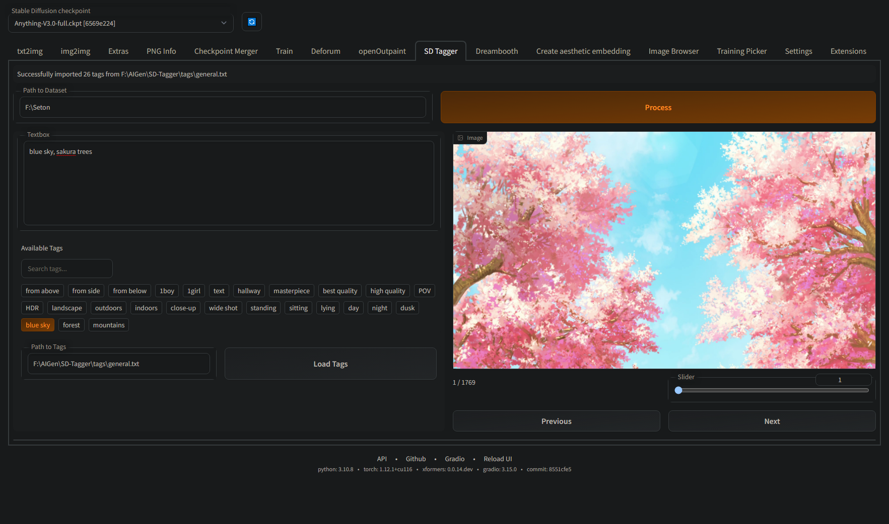

# Stable Diffusion WebUI Tagger

*Work in Progress*

This is a small extension for AUTOMATIC's webui. It adds a tab for tagging images from a dataset.



## Getting Started

Just install the extension through the extensions tab or git clone into your extensions folder.

## Usage

### Dataset

Provide the dataset path and it will **recursively** find matching images and captions pairs *(e.g. example.txt / example.png)*. 
It **does not** support captions in the filename yet.

### Tags.txt

You can also provide a tags file with each tag on a new line.

```
from above
from side
from below
1boy
1girl
text
hallway
masterpiece
best quality
high quality
...
```

## Planned Features

- Cropping
- Image Interrogate
- ...