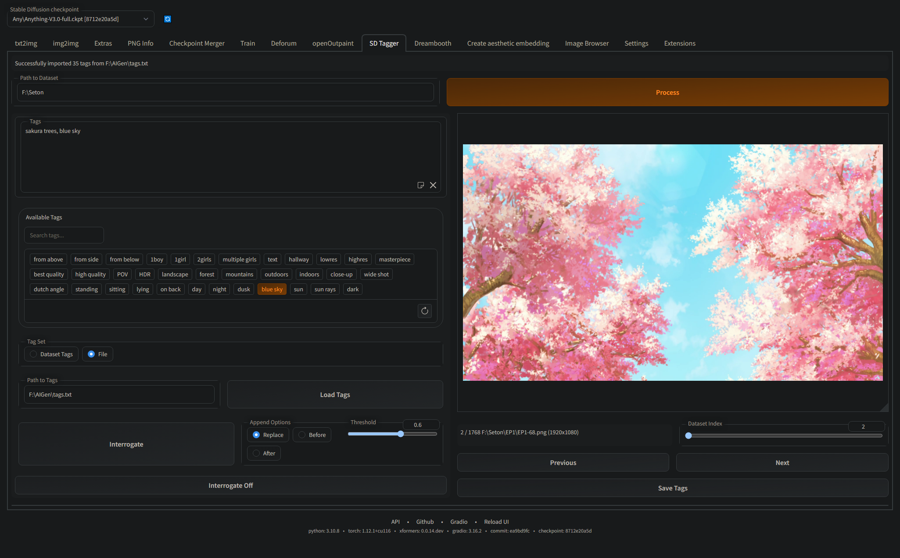
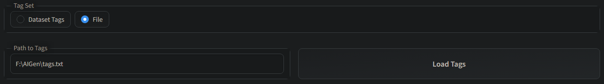
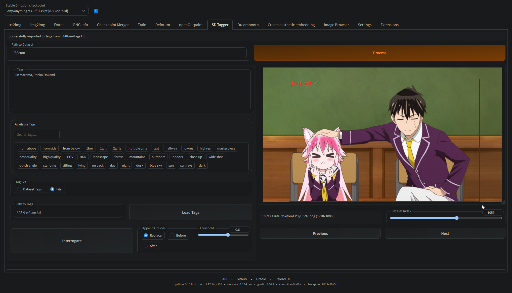
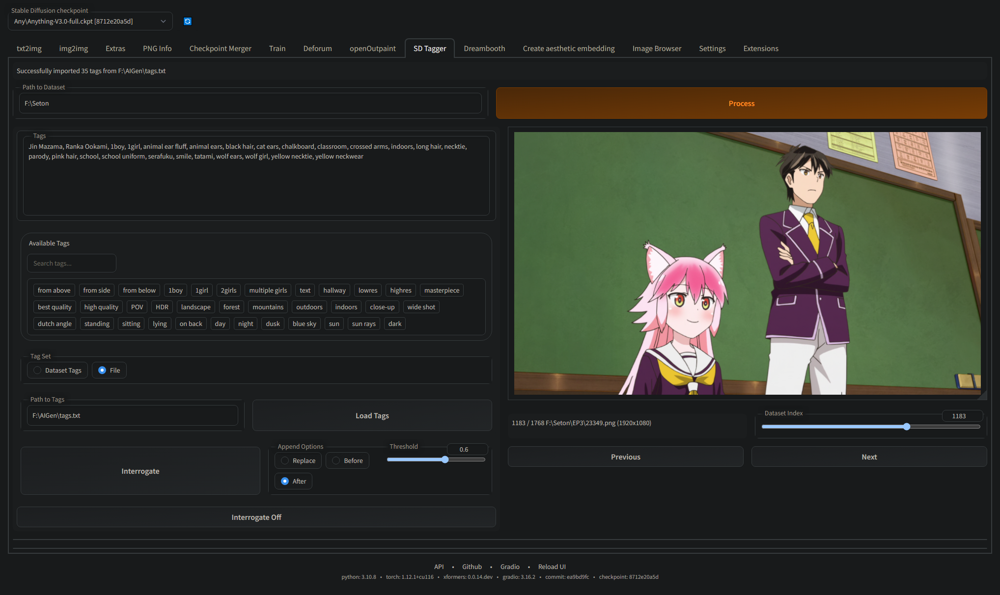

# Stable Diffusion WebUI Tagger

This is a small extension for AUTOMATIC's webui. It adds a tab for tagging images from a dataset.



## Getting Started

Just install the extension through the extensions tab or git clone into your extensions folder.

## Usage

### Dataset

Provide the dataset path and it will **recursively** find matching images and captions pairs *(e.g. example.txt / example.png)*. 
It **does not** support captions in the filename.

### Tags

For tagging you can provide either a separate tags file with each tag on a new line or use the tags present in your dataset.



The format for a tags file is as follows

```
from above
from side
from below
1boy
1girl
text
hallway
masterpiece
best quality
high quality
...
```

### Cropping

To crop an image just left-click and drag on the image. The cropped photo will be saved in
the /crops/ folder. By default, it snaps to a 64 pixel grid, you can change this in the settings.



### Interrogate

Interrogate an image using DeepDanbooru by setting a threshold clicking the interrogate button. You can also toggle auto-interrogation in the settings.



## Planned Features

- Faster loading
- More interrogators
- Tag pagination
- Cropping modes (Brush)
- ...
